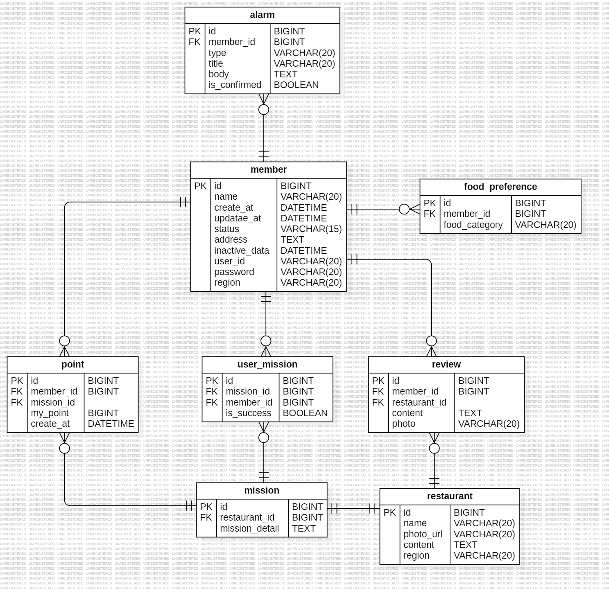

- 외래키
    
    다른 테이블의 기본 키를 참조하여 테이블 간의 관계를 정의하는 키.
    
- 기본키
    
    테이블에서 각 행을 고유하게 식별하는 키.
    
- ER 다이어그램
    
    엔티티와 관계를 시각적으로 표현한 다이어그램.
    
- 복합 키
    
    두 개 이상의 필드를 결합해 고유하게 식별하는 키.
    
    ```java
     @EmbeddedId
     private OrderProductId id;
        
        
     // 복합 키 클래스
    @Embeddable
    public class OrderProductId implements Serializable {
        private Long orderId;
        private Long productId;
    
        // 기본 생성자, equals(), hashCode() 필요
    }
    ```
    
- 연관관계
    
    두 테이블 간의 데이터 참조 관계.
- 반 정규화
    
    성능 향상을 위해 정규화된 테이블을 다시 합치거나 중복을 허용하는 과정
---

## 미션

