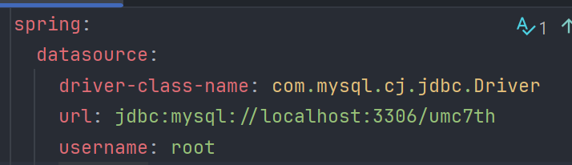

- **DI**
    
    의존성 주입
    
    생성자 주입을 권장함
    
    개발자가 new 하지 않아도 됨 
    
    - 유지 보수에 좋음
- **IoC**
    
    객체 간의 의존성을 외부에서 관리
    
    객체의 생성과 생명주기를 외부 컨테이너가 제어
    
- **프레임워크와 API의 차이**
    
    프레임워크는 애플리케이션의 구조와 흐름을 제어하는 일종의 틀
    
    프레임워크가 코드의 실행 흐름을 제어
    
    API 특정 기능을 외부에서 쉽게 사용할 수 있도록 제공 된 인터페이스
    
- **AOP**
    
    공통 관심사를 분리화하여 모듈화하는 것 (로깅 , 예외 처리,, )
    
    코드의 중복을 줄이고 유지보수를 용이하게 
    
- **서블릿**
    
    HTTP 요청과 응답을 처리하기 위한 객체
    
    서블릿 컨테이너에 의해 관리 됨

- **실습**
