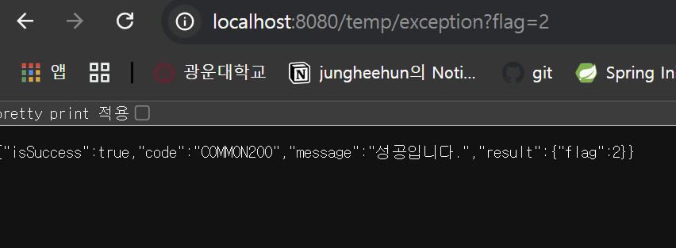
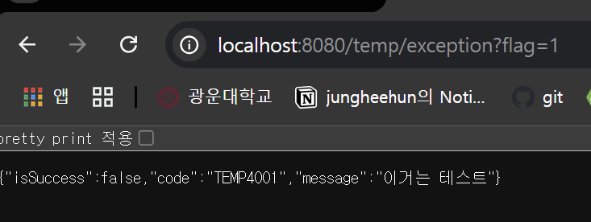

## 미션 
1

---
2

깃허브 링크 
https://github.com/heehunjung/umc-spring/tree/mission7

### RestContollerAdvice
- 전역 예외 처리로 중복 코드를 줄이고 모든 컨트롤러에서 일관된 에러 응답을 제공할 수 있다.
- 예외 처리 로직이 집중 관리되어 가독성과 유지보수성이 향상된다.
- - -
- 각 컨트롤러에서 예외 처리 로직을 개별적으로 구현해야 하므로, 코드가 중복되고 관리가 어렵다.